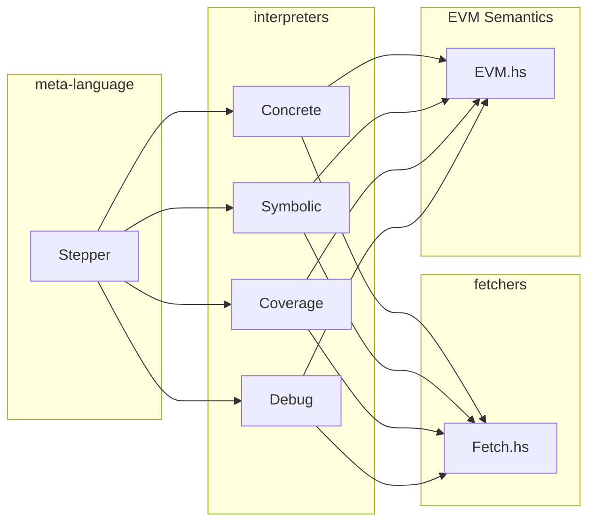

# Build System

All tools in this directory are built with `nix`, a declarative package manager
which gives a secure and predictable bundling of dependencies.

They are defined as attributes in the `./overlay.nix` file,
which in turn imports the `default.nix` file of each tool.

The dependencies of each tool is set as `buildInputs` in the `default.nix` file.

# dapp & seth

`dapp` and `seth` are similarly structured as a collection of short scripts, mostly written in bash.
The main entrypoint for any invocation of `seth` or `dapp` is a dispatch script,
`./src/seth/libexec/seth/seth` and `./src/dapp/libexec/dapp/dapp` respectively, which parses any
flags given, setting their values to the appropriate environment variable, and dispatches to the
appropriate subcommand.

# hevm

The core evm semnatics in hevm can be found in `EVM.hs`. EVM state is contained in the `VM` record,
and the `exec1` function executes a single opcode inside the monad `type EVM a = State VM a`.

The core semantics are pure, and should information from the outside world be required to continue
execution (rpc queries, smt queires, user input), execution will halt, and the `result` field of the
VM will be an instance of `VMFailure (Query _)`.

Multiple steps of EVM execution are orchestrated via interpreters for a meta language. Programs in
the meta language are called Steppers. The instructions in the meta language can be found in
`Stepper.hs`.

There are many different interpreters with different
features, e.g. a concrete interpreter, a symbolic interpreter, an interpreter that collects coverage
information, a debug interpreter that can accept user input. Interpreters can handle Queries in
different ways, for example in the symbolic inerpreter, both sides of a branch point will be
explored, while in the symbolic debug interpreter, user input will be requested to determine which
side of the branch point will be taken.

Interpreters are parameterized by a `Fetcher` that can handle rpc and smt queries, and can be
instantiated with fetchers that could have different fetching strategies (e.g. caching).

Interpreters execute Steppers and use their Fetcher to handle any Queries that need to be resolved.

This architecure is very modular and pluggable, and allows the core semantics to be shared between
different interpreters, as well as the reuse of steppers between different interpreters, making it
easy to e.g. replay a failed test in the debug interpreter, or to share the same test execution
strategy between concrete and symbolic interpreters.

